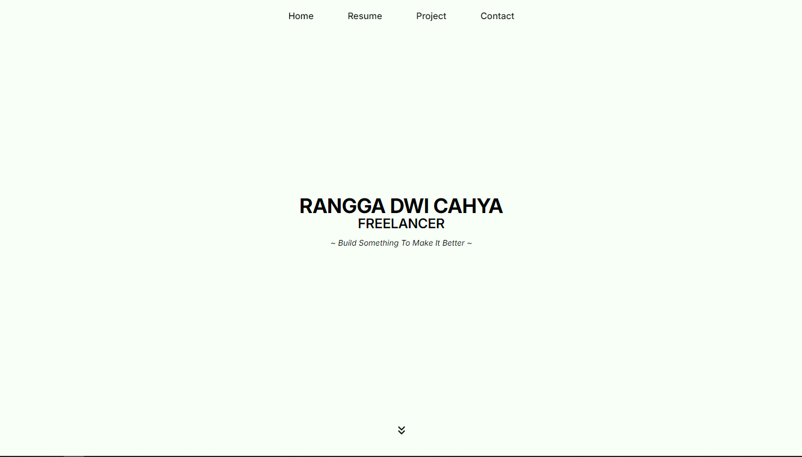

# Personal Portfolio Website

This is my personal portfolio website designed to showcase my skills, projects, and experience in web development. Built using **HTML**, **CSS**, **TailwindCSS**, and **JavaScript**, this website is fully responsive and optimized for various devices.

## Features

- **Responsive Design**: Fully responsive and mobile-friendly for all screen sizes.
- **Interactive Navigation**: Smooth scrolling and dynamic navigation.
- **Projects Section**: Highlights selected projects with descriptions and links.
- **Skills Section**: Categorized skills with filtering options.
- **About Me Section**: Introduces my background, expertise, and career goals.
- **Contact Form**: Functional form for users to send inquiries.
- **Dynamic Read More/Truncate**: Ensures large text blocks are collapsible for better user experience.

---

## Tech Stack

- **HTML**: Structure of the website.
- **CSS**: Base styling.
- **TailwindCSS**: Utility-first CSS framework for rapid UI development.
- **JavaScript**: Adds interactivity and dynamic behavior.

---

## Installation

1. Clone the repository:
   ```bash
   git clone https://github.com/yourusername/portfolio-website.git
   cd portfolio-website
   ```

2. Install dependencies if using a build tool (like Vite or Webpack):
   ```bash
   npm install
   ```

3. Start the development server:
   ```bash
   npm run dev
   ```

4. Open the website in your browser:
   ```
   http://localhost:3000
   ```

---

## Folder Structure

```
portfolio-website/
│
├── public/
│   └── assets/           # Images and icons
├── src/
│   ├── components/       # Reusable components (e.g., navbar, footer)
│   ├── styles/           # Tailwind CSS configuration and custom styles
│   ├── scripts/          # JavaScript files
│   └── index.html        # Main HTML file
│
├── tailwind.config.js    # TailwindCSS configuration
├── package.json          # Dependencies and scripts
└── README.md             # Project documentation
```

---

## Sections in the Portfolio

1. **Home**  
   A landing page with a hero section introducing my name, profession, and tagline.

2. **About Me**  
   A brief overview of my background, education, and expertise.

3. **Skills**  
   Categorized skills with filtering options (e.g., Front-end, Back-end, Others).

4. **Projects**  
   A showcase of selected projects with descriptions and links to live demos or GitHub repositories.

5. **Contact**  
   A simple contact form for visitors to get in touch.

---

## Customization

You can customize the following based on your preferences:

1. **TailwindCSS Configuration**  
   Update the `tailwind.config.js` file to modify theme colors, font families, or breakpoints.

2. **Content**  
   Replace placeholder content (e.g., name, project descriptions) in the HTML files.

3. **Styling**  
   Add custom CSS classes or override Tailwind styles if needed.

---

## Preview



---

## Deployment

1. Build the project for production:
   ```bash
   npm run build
   ```

2. Deploy using platforms like:
   - **Netlify**
   - **Vercel**
   - **GitHub Pages**

---

## License

This project is open-source and available under the [MIT License](./LICENSE).
